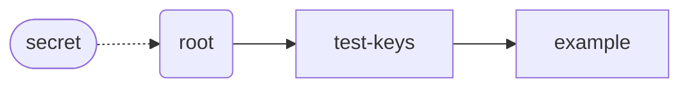

# Generating A Public Key

Now that you have a secret key, you can generate a public key to share with others:

```shell
veil public-key ./my-secret-key

#=> TkUWybv8fAvsHPhauPj7edUTVdCHuCFHazA6RjnvwJa
```

This is your root public key, which means it's derived directly from your secret key:


You can then give this public key to people, so they can send you encrypted messages.

## Derived Keys

You can also create derived keys using a key path:

```shell
veil public-key ./my-secret-key --key-path 'test-keys'

#=> 26UQ714wrvgp3YCFtMRoxWGM8GyxQkFBmknnudUaBQQL
```

This derives a public key from your root public key using a key path with a single label,
`test-keys`:


## Hierarchically Derived Keys

You can use a key path with multiple labels to [hierarchically derive keys](../design/hkd.md):

```shell
veil public-key ./my-secret-key --key-path 'test-keys' 'example'

#=> BkxmubpmYmKXDJ3euSmPRcvprQBPxFUaHd95Dz76QBV
```

This derives a public key from the `test-keys` public key using the label `example`:



Each key path you use will produce a different public key, which allows you to give different public
keys to different people. If those people compare those public keys, they won't be able to know
they're both yours unless you tell them, or they have your root public key and guess the key path.
